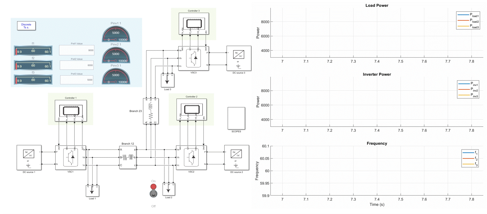

# Control Design of VSC with LCL Filter in dq Frame

### Overview

This repository presents the control design of a three-phase voltage source converter (VSC) connected to the grid through an LCL filter in the synchronous dq reference frame. It includes the system equations, current-loop and voltage-loop controller design, power relationships, and a numerical example for tuning PI gains.

#### Simulink Parameter Initialization

The Simulink model parameters are initialized in Model Explorer > Callbacks > InitFcn.

---

### System Description

A three-phase VSC is connected to the grid through an LCL filter. The main parameters are:

- $L_f, R_f$: inverter-side inductance and resistance  
- $C_f$: filter capacitance  
- $L_c, R_c$: grid-side inductance and resistance  

The control design here mainly uses:

- $L_f, R_f$ for current-loop design  
- $C_f$ for voltage-loop design  

#### Assumptions

1. Balanced three-phase operation  
2. dq reference frame aligned with the grid voltage  
3. Inner current loop is much faster than the outer voltage loop  

---

### dq Model of the System

#### Inverter-Side Inductor Dynamics

In the dq frame, the inverter-side inductor dynamics are:

$$
L_f \frac{di_d}{dt} = v_{cd} - v_d - R_f i_d + \omega L_f i_q
$$

$$
L_f \frac{di_q}{dt} = v_{cq} - v_q - R_f i_q - \omega L_f i_d
$$

where:

- $i_d, i_q$: dq-axis currents  
- $v_{cd}, v_{cq}$: converter output voltages  
- $v_d, v_q$: PCC voltages  
- $\omega$: grid angular frequency  

#### Capacitor Dynamics

$$
C_f \frac{dv_d}{dt} = i_d - i_{gd} + \omega C_f v_q
$$

$$
C_f \frac{dv_q}{dt} = i_q - i_{gq} - \omega C_f v_d
$$

#### Grid-Side Inductor Dynamics

$$
L_c \frac{di_{gd}}{dt} = v_d - v_{gd} - R_c i_{gd} + \omega L_c i_{gq}
$$

$$
L_c \frac{di_{gq}}{dt} = v_q - v_{gq} - R_c i_{gq} - \omega L_c i_{gd}
$$

---

### Decoupled Current-Loop Model

#### Cross-Coupling Compensation

The cross-coupling terms in the inverter-side inductor equations are compensated in control using feedforward decoupling:

$$
v_{cd}^\ast = v_{cd} - \omega L_f i_q
$$

$$
v_{cq}^\ast = v_{cq} + \omega L_f i_d
$$

#### Simplified Plant

After decoupling, the current dynamics reduce to:

$$
L_f \frac{di}{dt} + R_f i = v_c
$$

which gives the plant transfer function:

$$
G_i(s) = \frac{1}{L_f s + R_f}
$$

---

### Power Equations

#### Active and Reactive Power

The instantaneous active and reactive powers in the dq frame are:

$$
P = \frac{3}{2}(v_d i_d + v_q i_q)
$$

$$
Q = \frac{3}{2}(v_q i_d - v_d i_q)
$$

#### Grid-Voltage-Aligned Frame

With dq alignment to the grid voltage:

$$
v_q \approx 0
$$

so the power equations become:

$$
P \approx \frac{3}{2} v_d i_d
$$

$$
Q \approx -\frac{3}{2} v_d i_q
$$

Thus:

- $i_d$ mainly controls active power  
- $i_q$ mainly controls reactive power  

---

### Current Loop Design

#### Plant

$$
G_i(s) = \frac{1}{L_f s + R_f}
$$

#### PI Controller

$$
C_i(s) = K_{pc} + \frac{K_{ic}}{s}
$$

#### Gain Selection

Choose the PI zero to cancel the plant pole:

$$
\frac{K_{ic}}{K_{pc}} = \frac{R_f}{L_f}
$$

Let the desired current-loop bandwidth be:

$$
\omega_{ci}
$$

Then the controller gains are:

$$
K_{pc} = L_f \omega_{ci}
$$

$$
K_{ic} = R_f \omega_{ci}
$$

#### Closed-Loop Transfer Function

With this design, the current loop becomes:

$$
L_i(s) = \frac{\omega_{ci}}{s}
$$

and the closed-loop response is:

$$
\frac{i(s)}{i^\ast(s)} = \frac{\omega_{ci}}{s + \omega_{ci}}
$$

---

### Voltage Loop Design

#### Effective Plant Seen by the Voltage Controller

The capacitor dynamics are:

$$
C_f \frac{dv}{dt} = i
$$

Using the closed current-loop approximation:

$$
\frac{i(s)}{i^\ast(s)} = \frac{\omega_{ci}}{s + \omega_{ci}}
$$

the effective voltage-loop plant becomes:

$$
G_v(s) = \frac{\omega_{ci}}{(s + \omega_{ci})} \cdot \frac{1}{C_f s}
$$

#### PI Controller

$$
C_v(s) = K_{pv} + \frac{K_{iv}}{s}
$$

Define the controller zero frequency as:

$$
\omega_{cv} = \frac{K_{iv}}{K_{pv}}
$$

#### Phase Margin Relation

The open-loop phase at frequency $\omega$ is:

$$
\angle L_v(j\omega) = \tan^{-1}\left(\frac{\omega}{\omega_{cv}}\right) - \tan^{-1}\left(\frac{\omega}{\omega_{ci}}\right) - 180^\circ
$$

At gain crossover frequency $\omega_{gc}$, the phase margin is:

$$
pm = \tan^{-1}\left(\frac{\omega_{gc}}{\omega_{cv}}\right) - \tan^{-1}\left(\frac{\omega_{gc}}{\omega_{ci}}\right)
$$

#### Symmetric Design Choice

Choose:

$$
\omega_{gc} = \sqrt{\omega_{cv}\omega_{ci}}
$$

Let:

$$
a = \sqrt{\frac{\omega_{cv}}{\omega_{ci}}}
$$

Then:

$$
pm = 90^\circ - 2\tan^{-1}(a)
$$

which gives:

$$
a = \tan\left(\frac{90^\circ - pm}{2}\right)
$$

and therefore:

$$
\frac{\omega_{cv}}{\omega_{ci}} = a^2
$$

So the voltage-loop zero frequency becomes:

$$
\omega_{cv} = \omega_{ci}\frac{1 - \sin(pm)}{1 + \sin(pm)}
$$

#### Voltage-Loop Gains

Once $\omega_{cv}$ and $\omega_{gc}$ are selected:

$$
K_{pv} = C_f \omega_{gc}
$$

$$
K_{iv} = K_{pv}\omega_{cv}
$$

---

### Numerical Example

Given:

$$
f_{sw} = 10\,\text{kHz}
$$

$$
L_f = 3.5\,\text{mH}, \quad R_f = 0.1\,\Omega
$$

$$
C_f = 50\,\mu\text{F}
$$

and desired phase margin:

$$
pm = 50^\circ
$$

#### Current Loop

Choose the current-loop bandwidth as:

$$
\omega_{ci} = \frac{2\pi \cdot 10000}{4} = 15708
$$

Then:

$$
K_{pc} = L_f \omega_{ci} = 54.98
$$

$$
K_{ic} = R_f \omega_{ci} = 1570.8
$$

#### Voltage Loop

Using:

$$
\sin(50^\circ) = 0.766
$$

the voltage-loop zero frequency is:

$$
\omega_{cv} = 2082
$$

The crossover frequency is:

$$
\omega_{gc} = 5719
$$

So the voltage-loop PI gains are:

$$
K_{pv} = 0.286
$$

$$
K_{iv} = 595
$$

#### Final Controller Gains

$$
K_{pc} \approx 55
$$

$$
K_{ic} \approx 1571
$$

$$
K_{pv} \approx 0.286
$$

$$
K_{iv} \approx 595
$$

---

### Summary of Design Equations

#### Current Loop

| Quantity | Expression |
|---|---|
| Plant | $G_i(s)=\frac{1}{L_f s+R_f}$ |
| Controller | $C_i(s)=K_{pc}+\frac{K_{ic}}{s}$ |
| Zero cancellation | $\frac{K_{ic}}{K_{pc}}=\frac{R_f}{L_f}$ |
| Bandwidth choice | $\omega_{ci}=\frac{2\pi f_{sw}}{4}$ |
| Proportional gain | $K_{pc}=L_f\omega_{ci}$ |
| Integral gain | $K_{ic}=R_f\omega_{ci}$ |
| Closed-loop transfer function | $\frac{i(s)}{i^\ast(s)}=\frac{\omega_{ci}}{s+\omega_{ci}}$ |

#### Voltage Loop

| Quantity | Expression |
|---|---|
| Effective plant | $G_v(s)=\frac{\omega_{ci}}{(s+\omega_{ci})}\cdot\frac{1}{C_f s}$ |
| Controller | $C_v(s)=K_{pv}+\frac{K_{iv}}{s}$ |
| Zero frequency | $\omega_{cv}=\frac{K_{iv}}{K_{pv}}$ |
| Symmetric crossover choice | $\omega_{gc}=\sqrt{\omega_{cv}\omega_{ci}}$ |
| Phase-margin relation | $\omega_{cv}=\omega_{ci}\frac{1-\sin(pm)}{1+\sin(pm)}$ |
| Proportional gain | $K_{pv}=C_f\omega_{gc}$ |
| Integral gain | $K_{iv}=K_{pv}\omega_{cv}$ |

#### Numerical Example Summary

For $f_{sw}=10\,\text{kHz}$, $L_f=3.5\,\text{mH}$, $R_f=0.1\,\Omega$, $C_f=50\,\mu\text{F}$, and $pm=50^\circ$:

| Quantity | Value |
|---|---:|
| $\omega_{ci}$ | $15708\ \text{rad/s}$ |
| $K_{pc}$ | $54.98$ |
| $K_{ic}$ | $1570.8$ |
| $\omega_{cv}$ | $2082\ \text{rad/s}$ |
| $\omega_{gc}$ | $5719\ \text{rad/s}$ |
| $K_{pv}$ | $0.286$ |
| $K_{iv}$ | $595$ |

---
